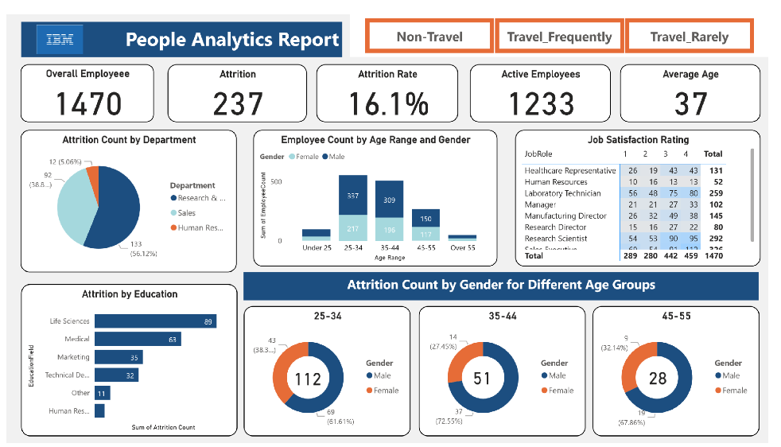

#  IBM-People Analytics-Dashboard

**Project Description:**
This repository contains an interactive HR analytics dashboard created using Power BI. The dashboard leverages data from an HR dataset provided by IBM on Kaggle. The dashboard focuses on exploring popular HR metrics and key performance indicators (KPIs), shedding light on various aspects such as attrition rates, job satisfaction ratings, and demographic insights.

**Dashboard Highlights:**
1. **Attrition Analysis:** Explore attrition count and attrition rate across gender, education qualification, and department to gain insights into the factors contributing to employee turnover.

2. **Job Satisfaction:** Analyze job satisfaction ratings across different professions and age groups, providing a comprehensive overview of employee satisfaction levels.

**Dashboard Features:**
- Interactive visuals for exploring and analyzing HR data.
- Utilization of DAX (Data Analysis Expressions) to create custom measures and KPIs.
- Card visuals displaying key metrics such as attrition count, attrition rate, and job satisfaction rating.
- Detailed breakdowns using slicers to filter data based on gender, education qualification, department, profession, and age grou

**Instructions for Viewing the Dashboard:**
1. Clone or download the repository.
2. Open the `IBM-People Analytics-Dashboard
.pbix` file using Power BI Desktop.
3. Interact with the dashboard visuals to explore the HR analytics insights.
4. Custom measures and KPIs will be displayed on card visuals.
5. Utilize slicers to filter data based on specific criteria such as gender, education, department, profession, and age group.

**Dashboard Preview:**

**Contributors:**
-Izudu Dan Ekeh.

-Okoro Maryclaire.

-Ereoforiokuma Smith Ikacheilom

**Acknowledgments:**
- The dataset used in this project is provided by IBM and can be found on Kaggle: [Link to Dataset](https://www.kaggle.com/datasets/pavansubhasht/ibm-hr-analytics-attrition-dataset)
- Power BI by Microsoft

